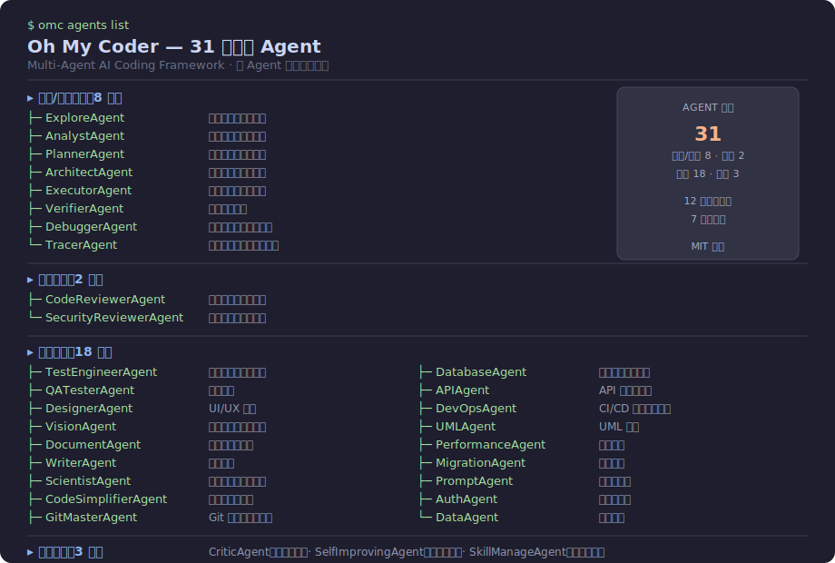
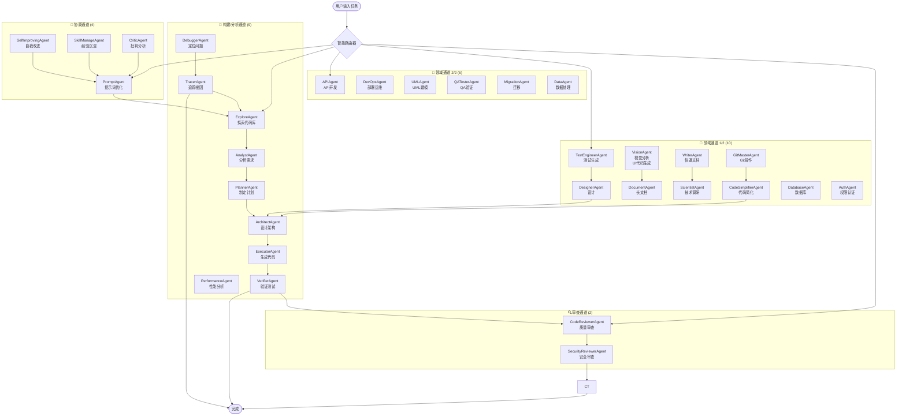

# Oh My Coder (OMC 中文版)

> 🤖 多智能体 AI 编程助手，支持国内大模型

🎯 **GLM-4.7-Flash 开源免费 · 12 家国产大模型 · 31 个专业 Agent · 多 Agent 协作 · 完全开源**

[](https://www.python.org/downloads/)
[](LICENSE)
[](https://github.com/VOBC/oh-my-coder/stargazers)
[](https://github.com/VOBC/oh-my-coder/network/members)
[](https://github.com/VOBC/oh-my-coder/commits)
[](https://github.com/VOBC/oh-my-coder/issues)

**灵感来源**: [oh-my-claudecode](https://github.com/Yeachan-Heo/oh-my-claudecode) (28.9k ⭐)



---

## 📖 目录

- [🎯 为什么选择 Oh My Coder？](#-为什么选择-oh-my-coder)
- [🚀 Claude Code 迁移指南](#-claude-code-迁移指南)
- [🎯 项目简介](#-项目简介)
- [🚀 快速开始](#-快速开始)
- [📖 快速示例](#-快速示例)
- [🎬 效果演示](#-效果演示)
- [🌐 Web 界面预览](#-web-界面预览)
- [🏗️ 架构设计](#️-架构设计)
- [🤖 Agent 系统（31 个专业 Agent）](#-agent-系统31-个专业-agent)
- [🧙 Quest Mode（异步自主编程）](#️-quest-mode异步自主编程)
- [🧠 主动学习模块](#-主动学习模块)
- [🧠 分层记忆系统](#-分层记忆系统)
- [🌐 多平台 Gateway](#-多平台-gateway)
- [🌐 工作目录上下文感知](#️-工作目录上下文感知)
- [🧠 支持的模型](#-支持的模型)
- [🔄 工作流](#-工作流)
- [📊 任务总结](#-任务总结)
- [🔒 安全特性](#-安全特性)
- [📁 项目结构](#-项目结构)
- [🧪 测试](#-测试)
- [📊 开发进度](#-开发进度)
- [❓ 常见问题](#-常见问题)
- [🤝 贡献](#-贡献)
- [📄 License](#-license)
- [🙏 致谢](#-致谢)

---

## 🎯 为什么选择 Oh My Coder？

> **GLM-4.7-Flash 开源免费 · 12 家国产模型 · 31 个专业 Agent · 多 Agent 协作 · 完全开源**

### ⚠️ Claude 封号？这里是国产替代方案

**2026年4月14日更新**：Claude 官方强制实名认证，中国大陆用户账号被封。如果你正在寻找 Claude Code 的替代品，oh-my-coder 是**最佳国产开源选择**：

| 对比项 | Claude Code | oh-my-coder |
|--------|-------------|-------------|
| **模型** | 仅 Claude（需翻墙） | **12个国产模型**（GLM-4.7-Flash 完全免费） |
| **价格** | 需 Claude Pro ($25/月) | **完全免费开源** |
| **数据隐私** | 上传到海外服务器 | **本地处理，不上传** |
| **中国用户** | 封号风险高 | **完全支持** |
| **Agent数量** | 约10个 | **31个专业Agent** |
| **开源** | 闭源 | **MIT开源协议** |

**迁移指南**：如果你之前用 Claude Code，切换到 oh-my-coder 只需：
```bash
pip install oh-my-coder
omc config set -k GLM_API_KEY -v "free"  # GLM-4.7-Flash 完全免费
omc run "你好，介绍一下你自己"
```

---

### 完整竞品对比（2026年AI编程工具生态）

#### 多Agent编排框架对比

| 工具 | 类型 | Stars | 价格 | 开源 | 国内可用 | 多Agent | 模型支持 |
|------|------|-------|------|------|----------|---------|----------|
| **oh-my-claudecode** | Claude Code插件 | 28,890 ⭐ (截至2026-04-19) | 需Claude Pro ($25/月) | ✅ | ⚠️ 需翻墙 | ✅ 32个Agent | 仅Claude |
| **oh-my-coder** | 多Agent框架 | 较少 | **免费** | **✅ MIT** | **✅** | ✅ 31个Agent | ✅ 12家国产模型 |
| **AutoGen** | 微软多Agent框架 | 大 | 免费 | ✅ | ⚠️ 需翻墙 | ✅ | 多模型 |
| **OpenCode** | 开源CLI | 中 | 免费 | ✅ | ✅ | ✅ | 75+模型 |
| **MyClaude** | 多后端编排 | 小 | 免费 | ✅ | ✅ | ✅ | Claude/Codex/Gemini |

#### 国内AI编程助手对比

| 工具 | 类型 | 价格 | 多Agent | 主要特点 |
|------|------|------|---------|----------|
| **腾讯云CodeBuddy** | IDE插件 | 免费个人版 / ¥78/人/月企业版 | ❌ | MCP协议支持，混元模型 |
| **文心快码(Comate)** | IDE插件 | 免费个人版 / ¥150/人/月企业版 | ✅ | SPEC规范驱动，200+语言 |
| **通义灵码** | IDE插件 | 免费 | ❌ | 阿里系集成 |
| **Cursor** | AI原生IDE | $20/月¹ | ⚠️ API需代理 | AI原生IDE |
| **GitHub Copilot** | 编辑器插件 | $19/月² | ❌ | GitHub生态集成 |
| **Claude Code** | AI编程CLI | 需Claude Pro ($25/月) | ✅ | 原生CLI，Agent能力 |
| **Qoder** | 多Agent编程 | 免费+付费 | ✅ | 多Agent协作 |

#### oh-my-coder 的定位

> **同类开源项目对比**：oh-my-coder 是目前**唯一一个**将多Agent编排框架 + 国产模型 + 中文交互 + 完全免费结合起来的开源项目。
>
> 与原版 oh-my-claudecode（28,890 ⭐ (截至2026-04-19)）相比，我们聚焦在**国产模型支持**和**零成本**两个核心差异点，适合无法使用Claude Pro/翻墙的国内开发者。

> 📌 **价格说明**：
> 1. Cursor: $20/月（以官网 https://cursor.sh 为准）
> 2. GitHub Copilot: $19/月（以官网 https://github.com/features/copilot 为准）
> 3. DeepSeek API 赠送额度（以 DeepSeek 官网活动为准）
> 4. 腾讯云CodeBuddy: ¥78/人/月企业版（以官网 copilot.tencent.com 为准）
> 5. 文心快码Comate: ¥150/人/月企业版（以官网 comate.baidu.com 为准）

### 核心优势对比

| 特性 | Oh My Coder | oh-my-claudecode | 腾讯CodeBuddy | Cursor | Copilot | AutoGen |
|------|:-----------:|:----------------:|:-------------:|:------:|:-------:|:-------:|
| 多Agent协作 | ✅ 31个 | ✅ 32个 | ❌ | ❌ | ❌ | ✅ |
| 开源免费 | ✅ MIT | ✅ | ⚠️ 企业版付费 | ❌ $20/月 | ❌ $19/月 | ✅ |
| 国内直连 | ✅ | ❌ 需翻墙 | ✅ | ❌ 需翻墙 | ❌ 需翻墙 | ✅ |
| 国产模型支持 | ✅ 12家 | ❌ | ✅ 混元 | ❌ | ❌ | ❌ |
| 中文交互 | ✅ | ❌ | ✅ | ✅ | ✅ | ⚠️ |
| 本地运行 | ✅ | ⚠️ 需Claude Code | ❌ | ❌ | ❌ | ✅ |
| 自托管 | ✅ | ❌ | ❌ | ❌ | ❌ | ✅ |
| **核心差异** | **国产模型+零成本** | **Claude生态** | **大厂背书** | **AI原生IDE** | **GitHub集成** | **企业级框架** |

> 🎯 **定位**：oh-my-claudecode 聚焦 Claude 生态（28,890 ⭐ (截至2026-04-19)，32个Agent，社区成熟）。我们专注**国产模型直连 + 中文优化 + 本地离线运行**，为国内开发者提供零门槛的多Agent编程体验。

---

## 🚀 Claude Code 迁移指南

**2026年4月14日**：Claude 官方强制实名认证，中国大陆用户账号被封。如果你正在寻找 Claude Code 的替代品，这里是完整的迁移指南：

### 📋 快速迁移步骤

```bash
# 1. 安装 oh-my-coder
pip install oh-my-coder

# 2. 配置 GLM-4.7-Flash（完全免费）
omc config set -k GLM_API_KEY -v "free"

# 3. 开始使用
omc run "解释这段代码" --workflow explore --file main.py
```

### 🔄 功能映射

| Claude Code 命令 | oh-my-coder 命令 |
|-----------------|------------------|
| `claude code explain` | `omc run --workflow explore` |
| `claude code refactor` | `omc run --workflow build` |
| `claude code debug` | `omc run --workflow debug` |
| `claude code review` | `omc run --workflow review` |
| `claude code test` | `omc run --workflow test` |

### 🤝 对接智谱搬家计划

智谱 AI 已推出"Claude API 用户特别搬家计划"：
- **新用户**：赠送 2000 万 Tokens 免费体验
- **API 兼容**：全面兼容 Claude 协议
- **无缝切换**：只需替换 API URL

在 oh-my-coder 中使用智谱 GLM：
```bash
omc config set -k GLM_API_KEY -v "你的智谱 API Key"
```

**详细迁移指南**：👉 [docs/guide/claude-migration.md](docs/guide/claude-migration.md)（包含故障排除和常见问题）

---

## 🎯 项目简介

Oh My Coder 是一个**多智能体协作编程系统**，通过多个专业 Agent 协作完成复杂开发任务。

**核心优势：**
- 🧠 **智能路由** - 根据任务类型自动选择合适模型，通过三层模型路由自动选择性价比最高的模型
- 🔄 **协作模式** - 多个 Agent 分工协作，像真实团队一样工作
- 🇨🇳 **中文优先** - 本土化设计，支持国内主流大模型
- ⚡ **成本优化** - 优先使用低成本/免费模型，支持 DeepSeek 等高性价比选项
- 🧠 **自动 Skills 生成** - 任务完成后自动判断是否值得沉淀为 Skill，4种触发条件：工具调用≥5次、错误修复、用户纠正、非平凡工作流，自动生成符合 SKILL.md 规范的技能文件，学习曲线：越用越聪明
- 🌐 **多平台 Gateway** - 支持 Telegram Bot / Discord Bot 双向消息，统一消息格式，跨平台协作，CLI 一键启动：`omc gateway start --telegram <token>`

---
## 🚀 快速开始

> 📖 [完整安装与配置指南](docs/guide/quickstart-detailed.md)（安装依赖、API Key 配置、模型特定配置、运行方式）

**最简三步**：
```bash
git clone https://github.com/VOBC/oh-my-coder.git && cd oh-my-coder
pip install -e .
export DEEPSEEK_API_KEY=your_key && python -m src.web.app
```

## 📖 快速示例

### CLI 示例

```bash
# 探索当前项目
python -m src.cli explore .

# 执行一个完整构建任务
python -m src.cli run "为用户模块添加 CRUD 接口"

# 代码审查
python -m src.cli run "审查 src/api 目录下的代码" -w review

# 调试问题
python -m src.cli run "修复登录接口偶发的超时问题" -w debug

# 查看所有 Agent
python -m src.cli agents

# === Quest Mode (异步自主编程) ===
# 创建 Quest
python -m src.cli run "实现用户认证模块" --quest

# 查看 Quest 列表
python -m src.cli quest-list

# 查看 Quest 状态
python -m src.cli quest-status <quest-id>

# 订阅桌面通知 + Webhook
python -m src.cli quest-notify --dingtalk https://oapi.dingtalk.com/robot/send?access_token=xxx

# === 工作目录上下文感知 ===
# 扫描项目文件
python -m src.cli context scan

# 获取项目摘要
python -m src.cli context summary

# 查看浏览器上下文（当前打开的标签页）
python -m src.cli context browser

# === 配置管理 ===
# 查看当前配置
python -m src.cli config show

# 设置 API Key（使用 -k 参数指定变量名，-v 指定值）
python -m src.cli config set -k DEEPSEEK_API_KEY -v <your-key>
python -m src.cli config set -k GLM_API_KEY -v <your-key>

# 列出可用模型
python -m src.cli config list-models

# === 代码清理 ===
# 扫描项目中的冗余代码
python -m src.cli clean .

# 自动修复可清理的问题
python -m src.cli clean . --fix

# 激进模式（自动删除空文件）
python -m src.cli clean . --aggressive

# === 成本估算 ===
# 根据任务描述推荐最优模型
python -m src.cli cost "设计新系统架构"

# 指定涉及文件数量以提高准确性
python -m src.cli cost "重构用户模块" --files 10

# 列出所有可用模型及定价
python -m src.cli cost --list

# === 版本迭代记忆 ===
# 列出历史决策记录
python -m src.cli agent decisions

# 检索相关历史决策（解决鬼打墙问题）
python -m src.cli agent decision "用户登录报错 500"

# 记录新的重要决策
python -m src.cli agent record-decision -t "修复 X 问题" -p "问题描述" -s "解决方案"

# 查看决策记忆统计
python -m src.cli agent decision-stats
```

### Web API 示例

```python
import httpx

# 调用异步执行（SSE 实时推送）
resp = httpx.post(
    "http://localhost:8000/api/execute",
    json={"task": "实现用户认证模块", "workflow": "build"},
    timeout=30
)
# resp.iter_lines() 接收 SSE 流式进度

# 同步执行（直接返回）
resp = httpx.post(
    "http://localhost:8000/api/execute-sync",
    json={"task": "审查 src/core 目录", "workflow": "review"}
)
print(resp.json()["result"])
```

### 输入 → 输出示例

| 任务输入 | 工作流 | 输出 |
|---------|--------|------|
| `"为商品模块添加分页查询接口"` | `build` | 自动探索项目结构 → 分析 API 规范 → 设计 REST 接口 → 生成代码 → 运行测试验证 |
| `"审查 src/auth 目录"` | `review` | 调用 CodeReviewerAgent + SecurityReviewerAgent，返回质量报告和安全建议 |
| `"修复注册接口的空指针异常"` | `debug` | 调用 TracerAgent 追踪调用链 → DebuggerAgent 定位根因 → 自动修复 |
| `"为 order.py 生成单元测试"` | `test` | 调用 TestEngineerAgent 分析函数 → 生成 pytest 测试用例 → 执行验证 |

---

## 🎬 效果演示

### Web 界面工作流动画

```
┌─────────────────────────────────────────────────────────────────────┐
│  Oh My Coder - Web Console                              🌙 深色模式  │
├─────────────────────────────────────────────────────────────────────┤
│  [🚀 build]  [🔍 review]  [🐛 debug]  [🧪 test]                      │
├─────────────────────────────────────────────────────────────────────┤
│                                                                      │
│  🔄 工作流执行中...                      Token: 12,450  成本: ¥0.02  │
│                                                                      │
│  ┌─ ExploreAgent ──────────────────────────────── ✅ 已完成 ──────┐  │
│  │  发现 142 个文件，识别为 FastAPI 项目，主框架: FastAPI 0.104    │  │
│  └─────────────────────────────────────────────────────────────────┘  │
│  │                                                             ▼     │
│  ┌─ AnalystAgent ───────────────────────────────── 🔄 进行中 ──────┐  │
│  │  正在分析用户模块需求，识别到 3 个实体、2 个关联关系              │  │
│  └─────────────────────────────────────────────────────────────────┘  │
│  │                                                             ▼     │
│  ┌─ ArchitectAgent ─────────────────────────────── ⏳ 等待中 ──────┐  │
│  └─────────────────────────────────────────────────────────────────┘  │
│  │                                                             ▼     │
│  ┌─ ExecutorAgent ─────────────────────────────── ⏳ 等待中 ──────┐  │
│  └─────────────────────────────────────────────────────────────────┘  │
│  │                                                             ▼     │
│  ┌─ VerifierAgent ─────────────────────────────── ⏳ 等待中 ──────┐  │
│  └─────────────────────────────────────────────────────────────────┘  │
│                                                                      │
└─────────────────────────────────────────────────────────────────────┘
```

### CLI 执行示例

```bash
$ omc run "为商品模块添加分页查询接口" -w build

🚀 Oh My Coder
任务: 为商品模块添加分页查询接口
项目: /home/user/project
工作流: build

✅ Explore    → 发现 89 个文件，FastAPI 项目
✅ Analyst    → 识别 Product/Category 实体
✅ Architect  → RESTful 分页接口设计
✅ Executor   → 生成 product/pagination.py (45 行)
✅ Verifier   → pytest 全部通过 (3/3)

完成！耗时 8.2s | Token 8,230 | 成本 ¥0.01
```

---

## 🌐 Web 界面预览

启动后访问 **http://localhost:8000**：

> 📸 截图位置：`docs/screenshots/`（运行后请添加 `web-ui.png` 和 `cli-demo.png`）

| 功能 | 说明 |
|------|------|
| 🎨 **可视化工作流** | 实时显示 Explore → Analyst → Architect → Executor → Verifier 流水线动画 |
| ⚡ **SSE 实时推送** | 无轮询，任务进度毫秒级更新 |
| 🤝 **Agent 协作 HUD** | Dashboard 右侧实时面板：活跃（红点）+ 已完成（绿勾）+ 待执行（灰），每 2 秒自动刷新 |
| 📋 **多视图输出** | 每个 Agent 的输出独立标签页，随时切换 |
| 📊 **成本统计** | Token 消耗、执行时间、步骤完成情况 |
| 🌙 **深色模式** | 明暗主题一键切换 |
| 💡 **示例任务** | 内置 4 种任务模板，一键填入 |

### API 端点

| 方法 | 路径 | 说明 |
|------|------|------|
| `POST` | `/api/execute` | 异步执行（SSE 实时推送） |
| `POST` | `/api/execute-sync` | 同步执行（直接返回结果） |
| `GET` | `/api/tasks` | 列出所有任务 |
| `GET` | `/api/tasks/{id}` | 获取任务详情 |
| `GET` | `/sse/execute/{id}` | SSE 流，接收实时进度 |
| `GET` | `/api/agent/live` | SSE 流，多 Agent 协作状态实时推送 |
| `GET` | `/health` | 健康检查 |

### curl 调用示例

```bash
# 异步执行（带 SSE 进度）
curl -X POST http://localhost:8000/api/execute \
  -H "Content-Type: application/json" \
  -d '{"task": "实现一个 REST API", "workflow": "build"}'

# 同步执行（直接返回）
curl -X POST http://localhost:8000/api/execute-sync \
  -H "Content-Type: application/json" \
  -d '{"task": "审查代码质量", "workflow": "review"}'
```

---

## 🏗️ 架构设计

### 多 Agent 协作流程



### 三层模型路由

```
┌──────────────┐     ┌──────────────┐     ┌──────────────┐
│   任务类型    │ ──▶ │   模型层级    │ ──▶ │   提供商选择  │
└──────────────┘     └──────────────┘     └──────────────┘
    EXPLORE              LOW (快)           DeepSeek
    ANALYST              MEDIUM (平衡)       DeepSeek
    ARCHITECT            HIGH (高质量)       DeepSeek
    CODE_GEN             MEDIUM              DeepSeek
    REVIEW               LOW                 DeepSeek
```

---

## 🤖 Agent 系统（31 个专业 Agent）<a id="-agent-系统31-个专业-agent"></a>

### 构建 / 分析通道（9）
| Agent | 功能描述 |
|-------|---------|
| `ExploreAgent` | 探索代码库结构，生成项目地图 |
| `AnalystAgent` | 分析需求和任务，发现隐藏约束 |
| `PlannerAgent` | 规划开发计划，制定执行步骤 |
| `ArchitectAgent` | 设计系统架构和技术选型 |
| `ExecutorAgent` | 执行代码生成，支持 14 种语言 |
| `VerifierAgent` | 验证代码正确性，运行测试 |
| `DebuggerAgent` | 调试和修复代码错误 |
| `TracerAgent` | 追踪代码执行流程，定位根因 |
| `PerformanceAgent` | 性能分析、瓶颈定位和优化建议 |

### 审查通道（2）
| Agent | 功能描述 |
|-------|---------|
| `CodeReviewerAgent` | 代码质量审查，发现坏味道 |
| `SecurityReviewerAgent` | 代码安全审查，扫描漏洞 |

### 领域通道（16）
| Agent | 功能描述 |
|-------|---------|
| `TestEngineerAgent` | 生成单元测试和集成测试 |
| `DesignerAgent` | 界面和交互设计 |
| `VisionAgent` | 截图布局分析 + UI 代码自动生成（HTML/CSS/React） |
| `DocumentAgent` | 长篇技术文档、API 参考、架构文档 |
| `WriterAgent` | 快速文档、README、注释生成 |
| `ScientistAgent` | 技术调研和可行性分析 |
| `GitMasterAgent` | Git 操作自动化 |
| `CodeSimplifierAgent` | 代码简化优化 |
| `QATesterAgent` | QA 测试和质量验证 |
| `DatabaseAgent` | 数据库设计、SQL 优化和迁移 |
| `APIAgent` | REST API 设计、接口规范和文档 |
| `DevOpsAgent` | CI/CD 流水线、容器化和部署 |
| `UMLAgent` | UML 图表生成（类图/时序图/流程图） |
| `MigrationAgent` | 代码迁移、框架升级和技术债清理 |
| `AuthAgent` | 认证授权设计、安全策略审查 |
| `DataAgent` | 数据处理、ETL 流程和数据质量 |

### 协调通道（4）
| Agent | 功能描述 |
|-------|---------|
| `PromptAgent` | Prompt 工程优化和模板管理 |
| `SelfImprovingAgent` | 从执行结果中学习，优化路由策略 |
| `SkillManageAgent` | Skill 管理和自进化、经验沉淀 |
| `CriticAgent` | 审查计划和设计，提供改进建议 |

**模型层级说明：**
- **LOW** - 快速便宜（DeepSeek-V3 / GLM-4-Flash / Qwen-Turbo）
- **MEDIUM** - 平衡性能和成本（DeepSeek-R1 / Qwen-Max）
- **HIGH** - 最高质量推理（DeepSeek-R1-Reasoner / Qwen-Plus）

---

## 🧙 Quest Mode（异步自主编程）

Oh My Coder 支持**异步自主编程任务**，可以后台执行、实时通知。

### 核心特性

| 特性 | 说明 |
|------|------|
| **SPEC 生成** | 自动生成任务规格文档 |
| **步骤拆分** | 智能拆分任务为可执行步骤 |
| **断点续跑** | Checkpoint 快照（SHA256 差异检测）+ 一键回滚，任务中断不丢进度 |
| **验收确认** | 每个步骤执行完需要用户验收 |
| **失败重试** | 步骤失败自动触发重规划 |
| **桌面通知** | macOS 原生 + 8 种 Webhook 渠道（钉钉/Telegram/Discord/Slack/Teams/飞书/企业微信/PushPlus） |

### 工作流程

```
创建 Quest → 生成 SPEC → 用户确认 → 后台执行 → 步骤验收 → 完成
                                                      ↓
                                              失败 → 重试/跳过
```

### 使用方式

```bash
# 创建并执行 Quest（自动生成 SPEC）
python -m src.cli run "实现用户认证模块" --quest

# 查看 Quest 列表
python -m src.cli quest-list

# 查看详细状态
python -m src.cli quest-status <quest-id>

# 订阅通知（桌面 + 钉钉）
python -m src.cli quest-notify --dingtalk https://oapi.dingtalk.com/robot/send?access_token=xxx

# === 国际平台 ===
# Telegram
python -m src.cli quest-notify <quest-id> --telegram-bot-token <TOKEN> --telegram-chat-id <CHAT_ID>

# Discord
python -m src.cli quest-notify <quest-id> --discord https://discord.com/api/webhooks/xxx/xxx

# Slack
python -m src.cli quest-notify <quest-id> --slack https://hooks.slack.com/services/xxx/xxx/xxx

# Microsoft Teams
python -m src.cli quest-notify <quest-id> --teams https://outlook.office.com/webhook/xxx

# === 国内平台 ===
# 飞书（Lark）
python -m src.cli quest-notify <quest-id> --feishu https://open.feishu.cn/open-apis/bot/v2/hook/xxx

# 企业微信
python -m src.cli quest-notify <quest-id> --wecom https://qyapi.weixin.qq.com/cgi-bin/webhook/send?key=xxx

# PushPlus（微信公众号推送，只需 Token）
python -m src.cli quest-notify <quest-id> --pushplus <your_pushplus_token>

# 阻塞等待完成
python -m src.cli quest-wait <quest-id>
```

### 通知渠道

| 渠道 | 配置参数 | 说明 |
|------|----------|------|
| **桌面通知** | 默认开启 | macOS 原生通知 |
| **钉钉** | `--dingtalk <url>` | 自定义机器人 Webhook |
| **Telegram** | `--telegram-bot-token` + `--telegram-chat-id` | Bot API，Markdown 格式 |
| **Discord** | `--discord <webhook_url>` | Webhook，Embed 格式 |
| **Slack** | `--slack <webhook_url>` | Incoming Webhook，Block Kit 格式 |
| **Microsoft Teams** | `--teams <webhook_url>` | Incoming Webhook，Adaptive Card 格式 |
| **飞书（Lark）** | `--feishu <webhook_url>` | 自定义机器人，支持卡片消息 |
| **企业微信** | `--wecom <webhook_url>` | Webhook，Markdown 格式 |
| **PushPlus** | `--pushplus <token>` | 微信公众号推送，最简配置 |

> 📖 详细文档：[Quest Mode 详解](docs/QUEST_MODE.md)

---

## 🧠 主动学习模块

Oh My Coder 内置**主动学习**能力，可以从执行结果中学习并优化策略。

### 功能

| 模块 | 说明 |
|------|------|
| **反馈收集** | 收集成功/失败/用户修正反馈 |
| **模式分析** | 分析失败类型（理解错误、执行错误、验证错误） |
| **策略适配** | 根据模式类型推荐不同策略 |
| **提示词调优** | 根据反馈自动调整 Agent system prompt |
| **Skill 自进化** | 工作流完成后自动将经验沉淀为 `.omc/skills/` Skill 文件 |

### Skill 自进化系统

每次工作流完成后，Oh My Coder 自动评估是否值得沉淀经验：

**触发条件（满足任一）：**
- 工具调用 ≥5 次且成功
- 错误 → 解决
- 用户纠正
- 非平凡工作流（≥3 步骤）

**Skill 文件结构：**
```
.omc/skills/
├── index.json           # 全量索引
├── debugging/           # 调试经验（bug fix、troubleshooting）
│   └── sql-slow-fix/
│       └── SKILL.md    # YAML frontmatter + Markdown 正文
├── workflow/           # 工作流经验
├── corrections/        # 被纠正后的修复
└── best-practices/     # 最佳实践
```

**Tier 0 自动注入：** 所有 Agent 执行前，Orchestrator 自动读取 `index.json`，将所有 Skill 的名字+描述追加到系统 Prompt 底部（~500 token），让 Agent 知道有哪些经验可用。

**CRUD 工具：** `skill-manage` Agent 支持 create / patch / delete / list / search 操作，patch 优先于 create。

```python
from src.memory.skill_manager import SkillManager

sm = SkillManager()

# 创建 Skill
sm.create(name="SQL 慢查询修复", body="# 正文...", category="debugging",
          tags=["sql", "performance"], triggers=["查询慢"])

# patch（优先）
sm.patch(skill_id="sql-slow-fix", body="更新后的正文...")

# 搜索
results = sm.search("sql 慢查询")
```

数据存储在 `~/.omc/` 目录。

---

> 📖 详细文档：[主动学习模块](docs/SELF_IMPROVING.md)

---

## 🧠 分层记忆系统

Oh My Coder 采用**分层有限记忆**架构，在不同上下文窗口限制下提供最优记忆注入。

| 层级 | Token 限制 | 内容 | 用途 |
|------|-----------|------|------|
| **Tier 0** | < 500 | 核心记忆（最近项目、偏好、经验） | 系统 Prompt 注入 |
| **Tier 1** | < 2000 | 精选记忆（项目详情、常用命令） | 上下文补充 |
| **Tier 2** | 无限制 | 完整存档（所有项目、学习记录） | 搜索、导出 |

```bash
omc memory core       # Tier 0 核心记忆
omc memory selected   # Tier 1 精选记忆
omc memory archive    # Tier 2 完整存档
omc memory search "FastAPI"  # 搜索记忆
omc memory stats      # 记忆统计
```

📖 详见 [分层记忆系统文档](docs/guide/memory-system.md)

---

> 📖 详细文档：[分层记忆系统](docs/MEMORY_SYSTEM.md)

---

## 🌐 多平台 Gateway

支持 Telegram / Discord / WhatsApp / 飞书 / 企业微信 / 钉钉 / Slack 双向消息接入，统一消息格式，跨平台协作。

```bash
omc gateway list              # 列出支持的平台
omc gateway test telegram     # 测试连接
```

| 平台 | 状态 | 环境变量 |
|------|------|----------|
| Telegram | ✅ | `TELEGRAM_BOT_TOKEN` |
| Discord | ✅ | `DISCORD_BOT_TOKEN` |
| WhatsApp | ✅ | `WHATSAPP_*` |
| 飞书 / Lark | ✅ | `FEISHU_*` |
| 企业微信 | ✅ | `WECOM_*` |
| 钉钉 | ✅ | `DINGTALK_*` |
| Slack | ✅ | `SLACK_*` |

📖 详见 [Gateway 文档](docs/guide/gateway.md)

---

## ⚡ 模型切换 CLI

一键切换默认模型，无需重启：

```bash
omc model list            # 列出所有 12 个支持的模型
omc model current         # 显示当前模型
omc model switch glm      # 切换到智谱 GLM
```

配置存储在 `~/.config/oh-my-coder/config.json`，环境变量 `OMC_DEFAULT_MODEL` 优先级更高。

---

## 🌐 工作目录上下文感知

Oh My Coder 可以感知当前工作目录和浏览器上下文，为 Agent 提供更准确的信息。

### 功能

| 命令 | 说明 |
|------|------|
| `context scan` | 扫描项目文件结构，生成文件树 |
| `context summary` | 生成项目摘要（语言统计、关键文件） |
| `context tree` | 显示项目文件树 |
| `context stats` | 显示项目统计信息 |
| `context browser` | 获取浏览器当前打开的页面 |
| `checkpoint --list` | 列出所有快照 |
| `checkpoint --restore <id>` | 回滚到指定快照（自动备份当前状态） |
| `checkpoint --diff <id>` | 查看快照与当前工作区的差异 |
| `checkpoint --delete <id>` | 删除快照 |
| `mcp --start` | 启动 MCP Server（stdio 模式） |
| `mcp --install` | 生成 Claude Desktop / Cursor MCP 配置 |
| `mcp --list` | 列出所有 MCP tools 和 resources |
| `mcp --status` | 查看 MCP 连接状态 |

### 使用示例

```bash
# 扫描项目
python -m src.cli context scan

# 获取摘要
python -m src.cli context summary

# 查看浏览器
python -m src.cli context browser
```

---

## 🧠 支持的模型

共 **12 个**模型提供商，系统自动按性价比选择：

### 模型支持状态

| 提供商 | 支持状态 | 备注 |
|--------|----------|------|
| **DeepSeek** | ✅ [生产就绪] | ⭐ 推荐首选，DeepSeek-V3 **免费额度**，推理能力强 |
| **MiMo** | ✅ [生产就绪] | 小米 MiMo，mimo-v2-flash **免费**，1M 上下文 |
| **智谱 GLM** | ✅ [生产就绪] | GLM-4-Flash **官方免费**，函数调用支持，兼容性好 |
| **Kimi** | ✅ [生产就绪] | 128K 上下文，适合大代码库 |
| **豆包** | ✅ [生产就绪] | 字节自研，响应速度快 |
| **天工AI** | ✅ [生产就绪] | 昆仑万维出品，中文理解强 |
| **百川智能** | ✅ [生产就绪] | 王小川创办，中文能力出色 |
| **MiniMax** | ⚠️ [Beta] | 中文理解强，但无函数调用（tools）实现 |
| **通义千问** | ⚠️ [Beta] | 阿里多模型，无重试机制，高并发偶发超时 |
| **讯飞星火** | ⚠️ [待完善] | 需三凭证（API Key + App ID + Secret Key），认证复杂 |
| **文心一言** | ⚠️ [待完善] | 需双 Key 认证（API Key + Secret Key），文档不完善 |
| **混元** | ⚠️ [待完善] | 需双 Key 认证（API Key + Secret Key），长文本处理慢 |

| 提供商 | 环境变量 | 默认模型 | 特点 |
|--------|----------|----------|------|
| **DeepSeek** | `DEEPSEEK_API_KEY` | `deepseek-chat` | ⭐ 免费额度，推理能力强 |
| **MiMo** | `MIMOAPIKEY` | `mimo-v2-flash` | 小米 MiMo，免费 256K / Pro 1M 上下文 |
| **智谱 GLM** | `GLM_API_KEY` | `glm-4-flash` | 官方免费，函数调用支持 |
| **Kimi** | `KIMI_API_KEY` | `moonshot-v1-128k` | 128K 超长上下文 |
| **豆包** | `DOUBAO_API_KEY` | `doubao-pro-32k` | 字节自研，响应快 |
| **天工AI** | `TIANGONG_API_KEY` | `skywork-v1.0` | 昆仑万维出品，中文强 |
| **百川智能** | `BAICHUAN_API_KEY` | `Baichuan4` | 王小川创办，中文出色 |
| **MiniMax** | `MINIMAX_API_KEY` | `abab6-chat` | 中文理解强 |
| **通义千问** | `TONGYI_API_KEY` | `qwen-turbo` | 阿里多模型 |
| **讯飞星火** | `SPARK_API_KEY` + `SPARK_APP_ID` + `SPARK_SECRET_KEY` | `generalv3.5` | 科大讯飞出品，语音交互 |
| **文心一言** | `WENXIN_API_KEY` + `WENXIN_SECRET_KEY` | `ernie-4.0-8k-latest` | 百度中文强 |
| **混元** | `HUNYUAN_API_KEY` + `HUNYUAN_SECRET_KEY` | `hunyuan-pro` | 腾讯自研 |

> 💡 只需配置 `DEEPSEEK_API_KEY` 即可使用，其他模型可选配置作为备用。

---

## 🔄 工作流

| 工作流 | 命令 | 说明 |
|--------|------|------|
| 🚀 `build` | `-w build` | 完整开发流程：探索 → 分析 → 设计 → 实现 → 验证 |
| 🔍 `review` | `-w review` | 代码审查 + 安全审查 |
| 🐛 `debug` | `-w debug` | 问题定位 → 修复 → 验证 |
| 🧪 `test` | `-w test` | 设计测试 → 实现测试 → 运行验证 |
| 🤖 `autopilot` | `-w autopilot` | 自动路由：根据任务关键词自动选择合适工作流 |
| 👥 `pair` | `-w pair` | 结对编程：Explorer + Critic 交替协作进行代码审查 |
| 🔧 `refactor` | `-w refactor` | 重构模式：分析热点 → 制定计划 → 执行 → 验证 → 测试 |

---

## 📊 任务总结

每个任务完成后自动生成结构化总结，记录执行全过程：

### 核心功能

| 功能 | 说明 |
|------|------|
| 全流程记录 | 每个 Agent 的执行时间、Token 消耗、执行结果 |
| 成本统计 | 自动计算总成本，支持多模型费用对比 |
| 优化建议 | 根据执行情况智能推荐优化策略 |
| 多格式导出 | JSON（机器解析）、TXT（快速查看）、HTML（报告分享） |

### 使用示例

```python
from src.core.summary import generate_summary, print_summary, save_summary

# 任务完成后生成总结
summary = generate_summary(
    task="为电商系统实现订单模块",
    workflow="build",
    completed_steps=[
        {"agent": "ExploreAgent", "status": "completed", "duration": 2.3, "tokens": 1200, "result": "发现 45 个文件"},
        {"agent": "AnalystAgent", "status": "completed", "duration": 5.1, "tokens": 3500, "result": "识别 3 个实体"},
        {"agent": "ArchitectAgent", "status": "completed", "duration": 8.2, "tokens": 5200, "result": "设计 REST API"},
        {"agent": "ExecutorAgent", "status": "completed", "duration": 15.7, "tokens": 12000, "result": "生成 8 个文件"},
        {"agent": "VerifierAgent", "status": "completed", "duration": 10.3, "tokens": 4800, "result": "pytest 18/18 通过"},
    ],
)

# 打印到终端
print_summary(summary)

# 保存为 HTML 报告
save_path = save_summary(summary, format="html")
# 输出: reports/summary_build_电商系统实现订单模块_20260407_113800.html
```

### 总结输出示例

```
✅ 任务: 为电商系统实现订单模块
📋 工作流: build
⏱️  耗时: 41.6s
💰 成本: ¥0.03
🔢 Token: 26,700
🤖 Agent 数: 5
🔧 模型: deepseek-chat, deepseek-chat, deepseek-reasoner

📊 执行步骤：
  1. ✅ Explore       - 2.3s | 1,200 tokens | 发现 45 个文件
  2. ✅ Analyst       - 5.1s | 3,500 tokens | 识别 3 个实体
  3. ✅ Architect     - 8.2s | 5,200 tokens | 设计 REST API
  4. ✅ Executor      - 15.7s | 12,000 tokens | 生成 8 个文件
  5. ✅ Verifier      - 10.3s | 4,800 tokens | pytest 18/18 通过

💡 优化建议：
  ✅ 执行效率良好，无需特殊优化
```

### 高级用法

```python
from src.core.summary import load_summary, print_summary_compact

# 从历史报告加载
summary = load_summary(Path("reports/summary_xxx.json"))

# 紧凑模式（单行，适合日志）
print_summary_compact(summary)
# 输出: ✅ [build] 为电商系统实现订单模块 | 41.6s | ¥0.03 | 5 agents
```

> 📌 总结文件默认保存在 `reports/` 目录，可通过 `output_dir` 参数自定义路径。

---

## 🧬 GEP 协议支持 (WIP)

基于 EvoMap GEP 协议，将能力包升级为可注册、可发现、可互通的标准格式。

### 核心概念

| 概念 | 说明 |
|------|------|
| **Gene** | 能力元数据（UUID、名称、分类、标签、描述、版本） |
| **Capsule** | 完整能力包（Gene + manifest 配置 + 依赖 + SHA256 校验） |
| **GEPRegistry** | 本地注册表（register / discover / resolve / export_event） |

### .omcp 向后兼容

旧 `.omcp` 格式自动升级为 Capsule：
- 有 `gene` 字段 → 直接使用
- 无 `gene` 字段 → 根据文件名和内容推断虚拟 Gene（向后兼容）

### GEP Event 格式

```json
{
  "type": "GEP/Register",
  "version": "1.0",
  "payload": {
    "gene": { "id": "...", "name": "...", "category": "..." },
    "manifest": { "tools": [...], "agents": {...} },
    "dependencies": [...],
    "checksum": "..."
  }
}
```

---

## 🔒 安全特性

Oh My Coder 高度重视代码安全：

- **本地执行** - 代码本地运行，不上传云端
- **密钥本地存储** - API 密钥仅存储在本地环境变量
- **安全审查** - 生成的代码经过 SecurityReviewerAgent 安全扫描
- **Diff 预览** - 修改文件前可预览变更（GitMasterAgent）
- **沙盒模式** - 支持在隔离环境中运行（需额外配置）

---

## 📁 项目结构

```
oh-my-coder/
├── src/
│   ├── agents/              # 智能体模块（31 个 Agent）
│   │   ├── base.py          # Agent 基类 & 注册机制
│   │   ├── explore.py       # 代码探索
│   │   ├── analyst.py        # 需求分析
│   │   ├── architect.py      # 架构设计
│   │   ├── executor.py       # 代码实现
│   │   ├── evolution.py      # 🆕 自进化 & 版本迭代记忆
│   │   ├── code_cleaner.py   # 🆕 代码清理 Agent
│   │   ├── cost_optimizer.py  # 🆕 成本优化建议
│   │   ├── smart_test.py     # 🆕 智能测试增强
│   │   └── ...
│   ├── core/                # 核心引擎
│   │   ├── router.py        # 三层模型路由器
│   │   ├── orchestrator.py  # 智能编排引擎
│   │   └── summary.py       # 任务总结生成器
│   ├── models/              # 模型适配层（12 个厂商）
│   │   ├── base.py          # 统一接口
│   │   ├── deepseek.py      # DeepSeek 适配器
│   │   ├── mimo.py          # 小米 MiMo
│   │   ├── glm.py           # 智谱 GLM
│   │   ├── kimi.py          # Kimi
│   │   ├── doubao.py        # 字节豆包
│   │   ├── tiangong.py      # 天工AI
│   │   ├── baichuan.py      # 百川智能
│   │   ├── tongyi.py        # 通义千问
│   │   ├── minimax.py       # MiniMax
│   │   ├── spark.py         # 讯飞星火
│   │   ├── wenxin.py        # 文心一言
│   │   └── hunyuan.py       # 腾讯混元
│   ├── web/                 # 🌐 Web 界面
│   │   ├── app.py           # FastAPI 应用 + SSE
│   │   ├── templates/       # HTML 模板
│   │   └── static/          # CSS 样式
│   ├── cli.py               # CLI 入口
│   └── main.py              # API 入口
├── tests/                   # 测试套件
│   ├── test_web.py          # Web 界面测试
│   └── test_integration.py   # 集成测试
├── examples/                # 示例代码
│   ├── web_demo.py          # Web API 使用示例
│   ├── cli_demo.py          # CLI 使用示例
│   └── advanced_demo.py     # 高级示例（多模型/Agent协作/总结）
├── docs/                    # 文档
├── requirements.txt         # 依赖
└── pyproject.toml          # 项目配置
```

---

## 🧪 测试

```bash
# 运行所有测试（770 个测试）
pytest

# 运行指定测试
pytest tests/test_web.py -v

# 带覆盖率
pytest --cov=src --cov-report=term-missing

# 仅 Web 界面测试
pytest tests/test_web.py -v

# 仅集成测试
pytest tests/test_integration.py -v

# 仅单元测试
pytest -m unit -v
```

---

## 📊 开发进度

- [x] 核心架构设计
- [x] 模型适配层（DeepSeek / 文心 / 通义 / GLM / Kimi / 豆包 / MiniMax / 混元）
- [x] Agent 基类和注册机制
- [x] 核心 Agent（31 个专业 Agent）
- [x] 编排引擎（顺序/并行/条件执行）
- [x] CLI 入口
- [x] Web 界面（SSE 实时推送）
- [x] 测试套件
- [x] 示例代码（基础 + 高级）
- [x] Docker 部署
- [x] 任务总结功能
- [x] CI/CD 完整测试（lint + build + multi-python）

---

## ❓ 常见问题

**Q: API Key 如何获取？**
A: 请访问对应模型的官方网站注册账号后获取：
   - DeepSeek: https://platform.deepseek.com/
   - 小米 MiMo: https://mimo.ai.utrain.cloud/
   - 智谱 GLM: https://open.bigmodel.cn/
   - Kimi: https://platform.moonshot.cn/
   - 豆包: https://console.volcengine.com/
   - 天工AI: https://model-platform.tiangong.cn/
   - 百川智能: https://platform.baichuan-ai.com/
   - 通义千问: https://dashscope.console.aliyun.com/
   - MiniMax: https://api.minimax.chat/
   - 讯飞星火: https://xinghuo.xfyun.cn/
   - 文心一言: https://console.bce.baidu.com/
   - 腾讯混元: https://console.cloud.tencent.com/hunyuan

**Q: 模型调用超时怎么办？**
A: 可通过以下方式解决：
   1. 在 Web 界面调整 timeout 设置
   2. 设置环境变量 `REQUEST_TIMEOUT=60`（秒）
   3. 检查网络连接，确认是否能访问对应 API 地址
   4. 切换到响应更快的模型（如 DeepSeek / 豆包）

**Q: 如何切换不同的模型？**
A: 设置对应模型的环境变量即可：
   ```bash
   export DEEPSEEK_API_KEY=your_key    # 默认使用
   export KIMI_API_KEY=your_key        # 备选模型
   ```
   路由器会根据任务类型和成本自动选择最优模型。

**Q: 生成的代码有安全问题怎么办？**
A: Oh My Coder 内置 SecurityReviewerAgent，会对生成的代码进行安全审查。建议配合 `omc run -w review` 进行额外审查后再合并代码。

**Q: 支持本地部署吗？**
A: 支持。提供三种方式：
   1. 直接安装：`pip install -r requirements.txt && python -m src.cli`
   2. Docker 部署：`docker compose up -d`
   3. 支持对接本地模型 API（如 Ollama）

---

## 🤝 贡献

欢迎提交 Issue 和 PR！详见 [CONTRIBUTING.md](CONTRIBUTING.md)。

### 快速贡献

1. Fork 本仓库
2. 创建特性分支 (`git checkout -b feature/amazing-feature`)
3. 提交更改 (`git commit -m 'feat: 添加某个很棒的功能'`)
4. 推送到分支 (`git push origin feature/amazing-feature`)
5. 创建 Pull Request

### 反馈渠道

- 🐛 [提交 Issue](https://github.com/VOBC/oh-my-coder/issues)
- 💬 [讨论区](https://github.com/VOBC/oh-my-coder/discussions)

---

## 📄 License

MIT License - 详见 [LICENSE](LICENSE)

---

## 🙏 致谢

- [oh-my-claudecode](https://github.com/Yeachan-Heo/oh-my-claudecode) 的启发
- [DeepSeek](https://platform.deepseek.com/) 提供优质 API 服务
- 所有贡献者

---

## ❤️ 支持这个项目

如果你觉得这个项目对你有帮助，可以通过以下方式支持我们：

### ⭐ 其他帮助方式

- **给项目点个 Star** — 让更多人看到这个项目
- **提交 Issue** — 反馈问题或建议新功能
- **提交 PR** — 贡献代码，帮助项目变得更好
- **分享给朋友** — 让更多需要的人知道这个工具

---

## 📈 Star History

[](https://star-history.com/#VOBC/oh-my-coder&Date)
