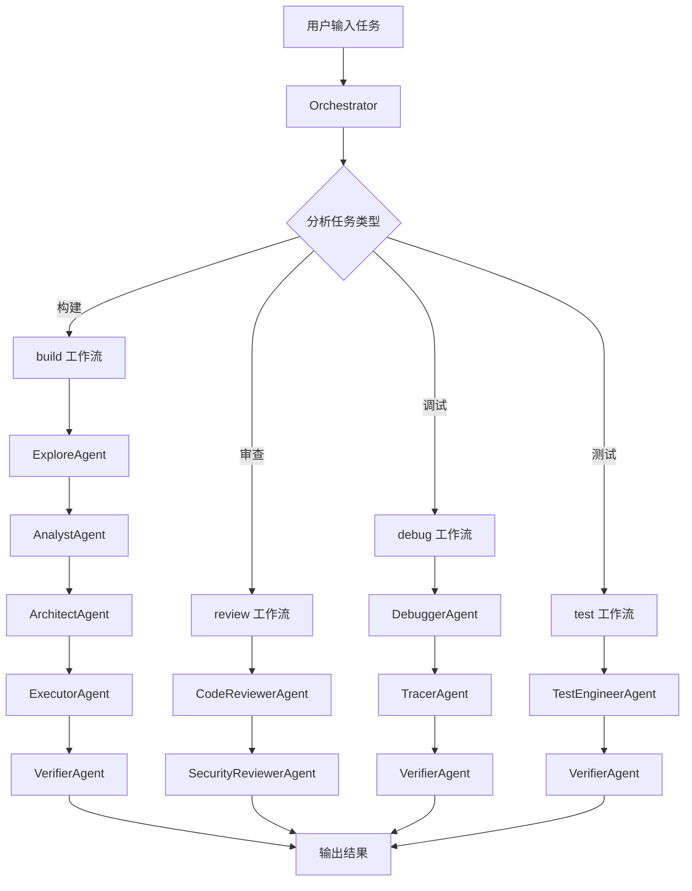
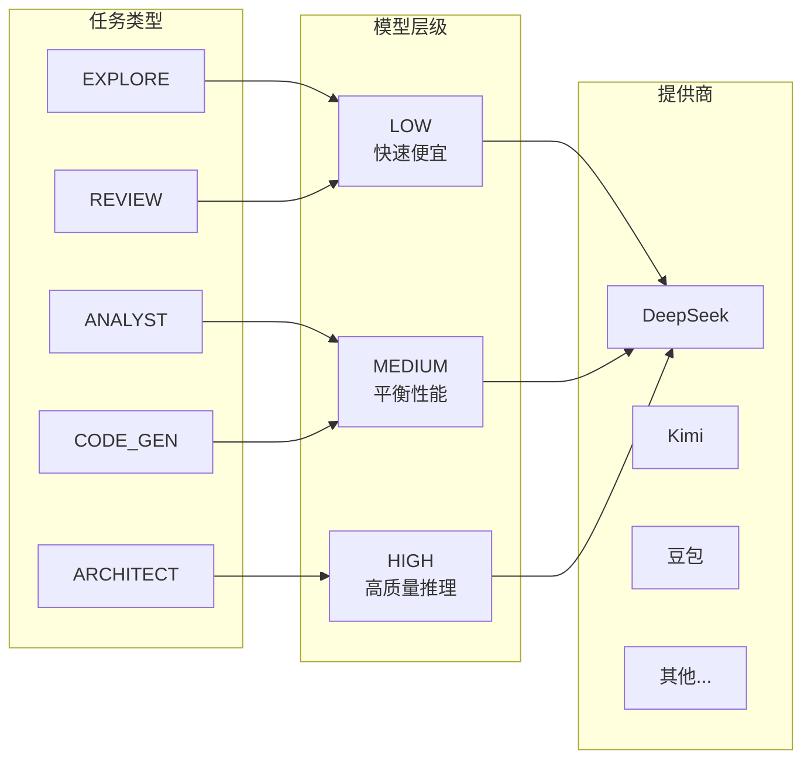
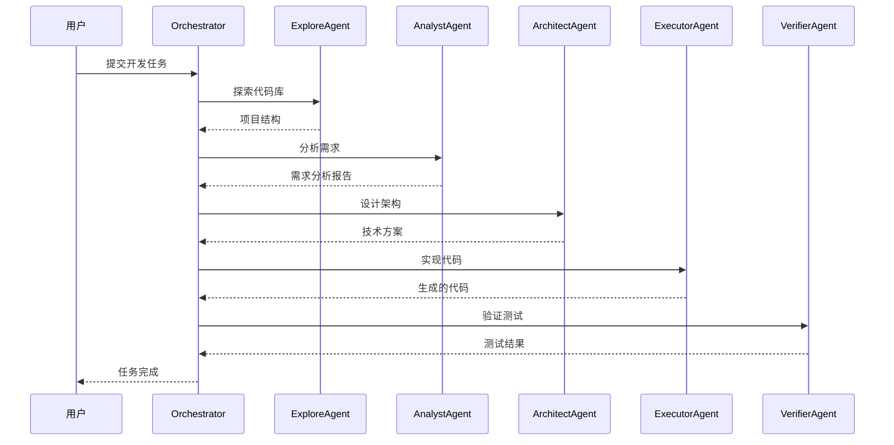
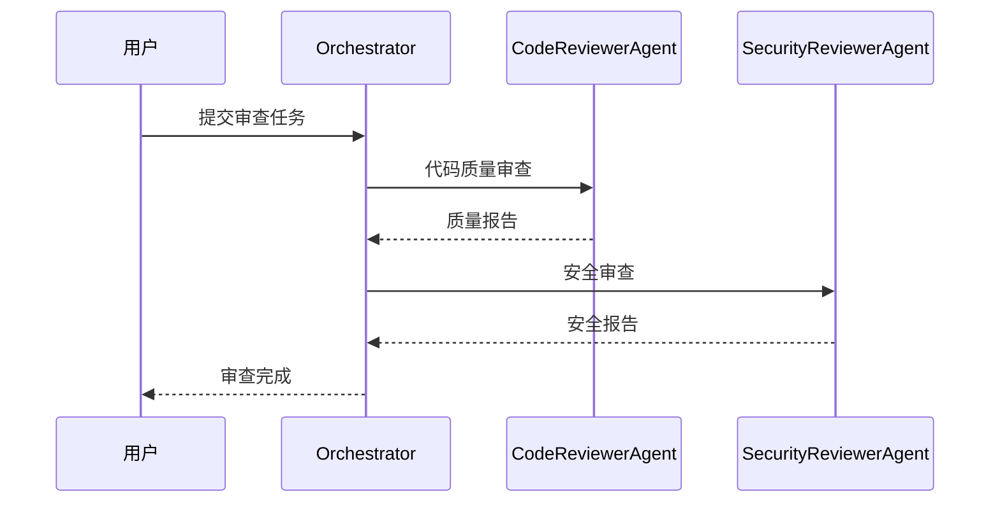
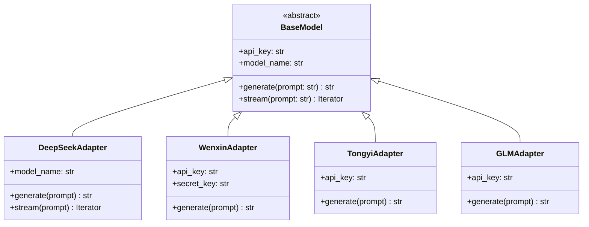
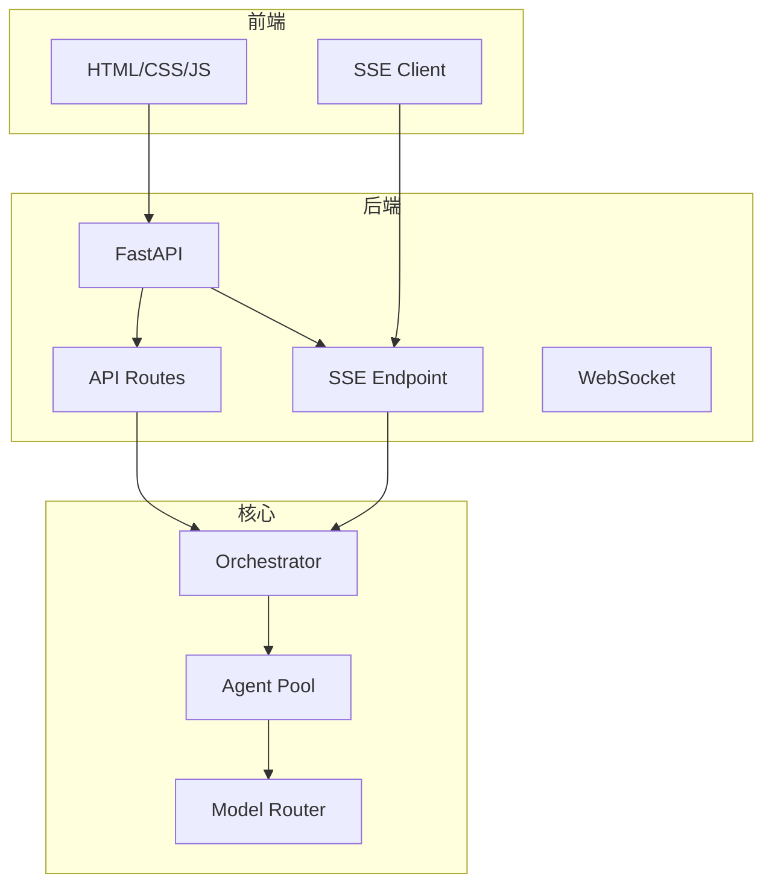

# 架构设计文档

## 系统概览

Oh My Coder 是一个多智能体协作编程系统，核心由三层组成：

```
┌─────────────────────────────────────────────────────────────────┐
│                         用户界面层                               │
│                    (CLI / Web / API)                            │
└─────────────────────────────────────────────────────────────────┘
                              │
                              ▼
┌─────────────────────────────────────────────────────────────────┐
│                         编排引擎层                               │
│              (Orchestrator + Router + Executor)                  │
└─────────────────────────────────────────────────────────────────┘
                              │
                              ▼
┌─────────────────────────────────────────────────────────────────┐
│                         智能体层                                 │
│                    (18 个专业 Agent)                             │
└─────────────────────────────────────────────────────────────────┘
                              │
                              ▼
┌─────────────────────────────────────────────────────────────────┐
│                         模型适配层                               │
│                  (8 家模型提供商适配器)                           │
└─────────────────────────────────────────────────────────────────┘
```

---

## 模块结构

```
oh-my-coder/
├── src/
│   ├── core/                    # 核心引擎
│   │   ├── orchestrator.py      # 智能体调度器
│   │   ├── router.py            # 三层模型路由
│   │   └── workflow.py          # 工作流定义
│   │
│   ├── agents/                  # 18 个专业智能体
│   │   ├── base.py              # Agent 基类
│   │   ├── explore.py           # 代码探索
│   │   ├── analyst.py           # 需求分析
│   │   ├── planner.py           # 计划制定
│   │   ├── architect.py         # 架构设计
│   │   ├── executor.py          # 代码实现
│   │   ├── verifier.py          # 验证测试
│   │   ├── debugger.py          # 调试修复
│   │   ├── tracer.py            # 流程追踪
│   │   ├── code_reviewer.py     # 代码审查
│   │   ├── security.py          # 安全审查
│   │   ├── test_engineer.py     # 测试工程
│   │   ├── designer.py          # UI 设计
│   │   ├── writer.py            # 文档生成
│   │   ├── scientist.py         # 技术调研
│   │   ├── git_master.py        # Git 操作
│   │   ├── code_simplifier.py   # 代码简化
│   │   ├── qa_tester.py         # QA 测试
│   │   └── critic.py            # 设计审查
│   │
│   ├── models/                  # 模型适配层
│   │   ├── base.py              # 统一接口
│   │   ├── deepseek.py          # DeepSeek
│   │   ├── wenxin.py            # 文心一言
│   │   ├── tongyi.py            # 通义千问
│   │   ├── glm.py               # 智谱 GLM
│   │   ├── kimi.py              # Kimi 月暗
│   │   ├── doubao.py            # 字节豆包
│   │   ├── minimax.py           # MiniMax
│   │   └── hunyuan.py           # 腾讯混元
│   │
│   ├── web/                     # Web 界面
│   │   ├── app.py               # FastAPI 应用
│   │   ├── templates/           # HTML 模板
│   │   └── static/              # CSS/JS
│   │
│   ├── cli.py                   # CLI 入口
│   └── main.py                  # API 入口
│
├── tests/                       # 测试套件
├── examples/                    # 示例代码
└── docs/                        # 文档
```

---

## 核心数据流



---

## 三层模型路由



### 路由策略

| 任务类型 | 层级 | 默认模型 | 说明 |
|---------|------|---------|------|
| EXPLORE | LOW | DeepSeek | 代码探索，需要快速响应 |
| ANALYST | MEDIUM | DeepSeek | 需求分析，需要理解能力 |
| ARCHITECT | HIGH | DeepSeek | 架构设计，需要深度推理 |
| CODE_GEN | MEDIUM | DeepSeek | 代码生成，平衡质量速度 |
| REVIEW | LOW | DeepSeek | 代码审查，快速扫描 |
| DEBUG | HIGH | DeepSeek | 调试问题，需要深度分析 |
| TEST | MEDIUM | DeepSeek | 测试生成，需要逻辑推理 |

---

## Agent 协作流程

### build 工作流（完整开发）



### review 工作流（代码审查）



---

## 模型适配器架构



### 统一接口

所有模型适配器实现相同接口：

```python
class BaseModel(ABC):
    """模型适配器基类"""
    
    @abstractmethod
    async def generate(
        self,
        prompt: str,
        max_tokens: int = 4096,
        temperature: float = 0.7
    ) -> str:
        """生成响应"""
        pass
    
    @abstractmethod
    async def stream(
        self,
        prompt: str
    ) -> AsyncIterator[str]:
        """流式生成"""
        pass
```

---

## Web 界面架构



### API 端点

| 端点 | 方法 | 说明 |
|------|------|------|
| `/api/execute` | POST | 异步执行任务 |
| `/api/execute-sync` | POST | 同步执行任务 |
| `/api/tasks` | GET | 列出任务 |
| `/api/tasks/{id}` | GET | 任务详情 |
| `/sse/execute/{id}` | GET | SSE 事件流 |
| `/health` | GET | 健康检查 |

---

## 配置管理

### 环境变量

```bash
# 模型配置
DEEPSEEK_API_KEY=sk-xxx
WENXIN_API_KEY=xxx
WENXIN_SECRET_KEY=xxx

# 可选：自定义 API 地址
DEEPSEEK_API_BASE=https://api.deepseek.com

# 可选：日志级别
LOG_LEVEL=INFO
```

### 模型优先级

系统按以下顺序选择模型：

1. DeepSeek（优先）
2. Kimi
3. 豆包
4. MiniMax
5. GLM
6. 通义千问
7. 文心一言
8. 混元

---

## 扩展机制

### 添加新 Agent

```python
from src.agents.base import BaseAgent, AgentRole

class MyCustomAgent(BaseAgent):
    """自定义 Agent"""
    
    role = AgentRole.CUSTOM
    tier = ModelTier.MEDIUM
    
    async def execute(self, context: dict) -> dict:
        # 实现逻辑
        return {"result": "..."}
```

### 添加新模型

```python
from src.models.base import BaseModel

class MyModelAdapter(BaseModel):
    """自定义模型适配器"""
    
    async def generate(self, prompt: str) -> str:
        # 调用模型 API
        return response
```

---

## 性能优化

### Token 优化

- 智能路由选择合适层级模型
- 上下文压缩和摘要
- 并行执行独立任务

### 缓存策略

- 模型响应缓存
- 项目结构缓存
- 增量分析

---

## 安全设计

- 本地运行，数据不上传
- API 密钥本地存储
- 代码审查安全检查
- 敏感操作确认机制
