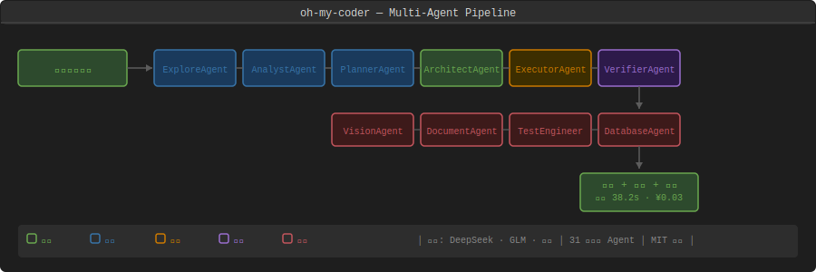
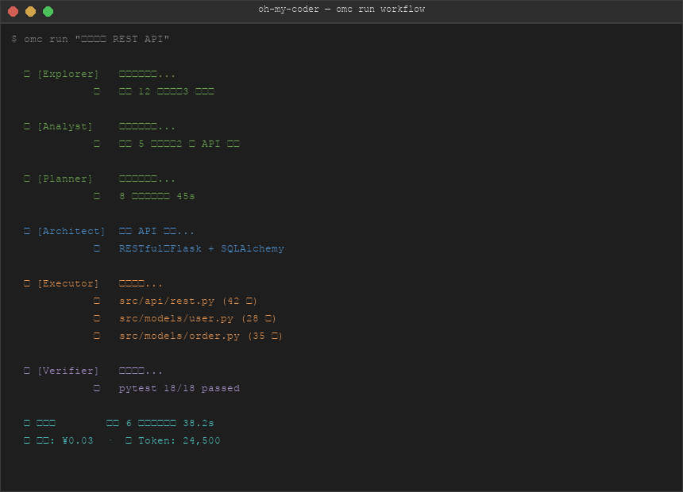
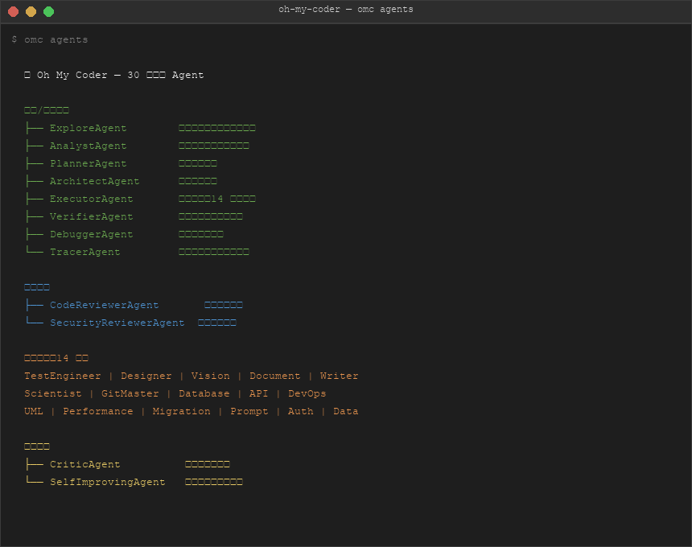
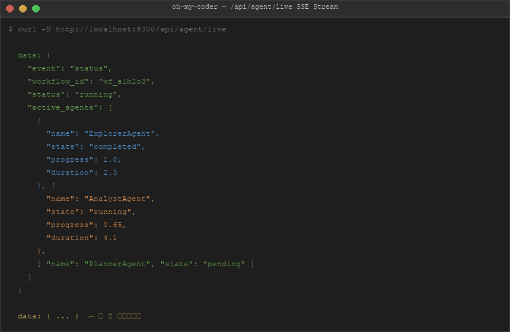

# Screenshots

真实运行截图 / Demo Screenshots

## Multi-Agent Pipeline

## CLI Workflow

运行 `omc run "实现一个 REST API"` 的完整流程：Explore → Analyze → Plan → Architect → Execute → Verify。

## Agent System

`omc agents` 输出：30 个专业 Agent，分为构建/分析、审查、领域、协调四个通道。

## Web SSE Stream

`curl -N http://localhost:8000/api/agent/live` — 每 2 秒推送当前 Agent 协作状态。
